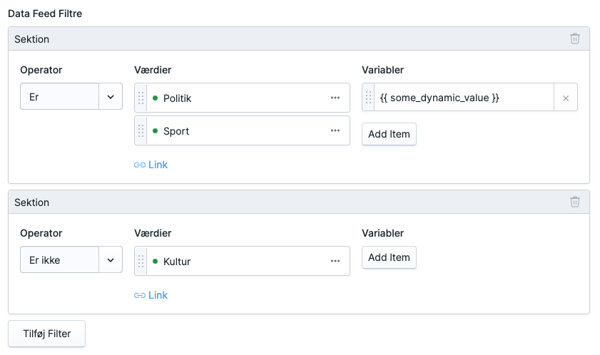
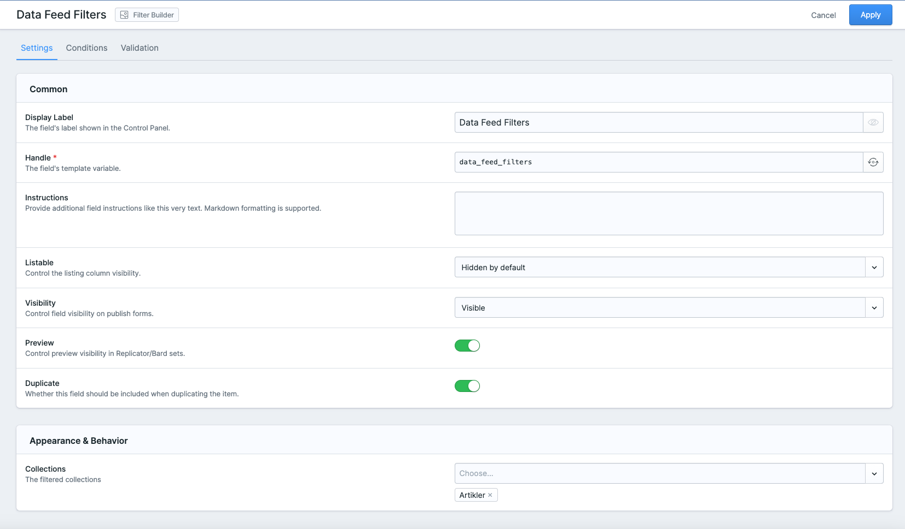

# Statamic Filter Builder Addon
Elevate your Statamic experience with the Filter Builder addon, a robust tool for crafting dynamic data queries and enriching the content management capabilities of your website.

This addon is perfect for developers and content managers who value precision and flexibility in displaying data within their site's architecture.

## Installation via Composer
The Statamic Filter Builder is installed using Composer:

```bash
composer require tv2regionerne/statamic-filter-builder
```
## Empower Your Content with Dynamic Data Filtering
By adding a filter builder field to your publishing forms, you unlock the ability to create sophisticated filtering rules that dynamically control what data is shown in each part of your site, such as specific sections or components.



## Field Configuration in Blueprint

When configuring the `Data Feed Filters` field within a blueprint you may select the collection to pick the fields from.

### Configuration Options:

- **Collections**: Define the collections to pick the blueprint(s) from. The fields found in the blueprint(s) can be used to create the filters.



## Unleash Advanced Functionality with Antlers
For those who seek advanced control, this addon leverages Antlers, Statamic's templating language, enabling you to inject dynamic variables directly into your queries. 

Variables can be sourced from the Cascade of Antlers, allowing you to use elements like `{{ page.title }}` as a dynamic value in your filtering logic.

### Advanced Use Case Example:
Imagine you want to display articles that share the same location as the current page. 
The Antlers code for this would be something like this:

```antlers
{{ page.locations | pluck('id') | to_json }}
```
By using `pluck('id')`, you ensure that the returned data is a flat array of IDs, not a complex structure. This array can then be used as a filter parameter to display a list of articles related by location, maintaining a clean and optimized data structure.

Here’s how to apply this advanced filter within your template:

```antlers
{{ collection:articles :filter_builder="my_filter_builder_field_handle" }}
    <!-- Articles that match the locations of the current page will be displayed -->
{{ /collection:articles }}

```
Note: the filter builder requires a query scope behind the scenes, so will not work alongside a query_scope parameter.

You may combine the dynamic Filter Builder query with filter parameters.

The Statamic Filter Builder addon is your pathway to creating a responsive and context-aware website, where content curation is as intelligent as it is effortless.
